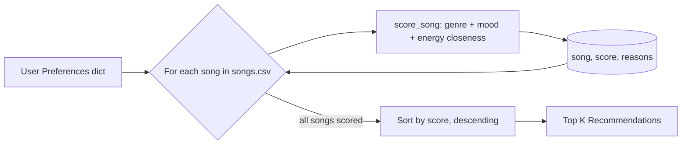

# 🎵 Music Recommender Simulation

## Project Summary

In this project you will build and explain a small music recommender system.

Your goal is to:

- Represent songs and a user "taste profile" as data
- Design a scoring rule that turns that data into recommendations
- Evaluate what your system gets right and wrong
- Reflect on how this mirrors real world AI recommenders

Replace this paragraph with your own summary of what your version does.

---

## How The System Works

Real-world recommenders like Spotify or YouTube generally combine two strategies. **Collaborative filtering** predicts what a user will like based on patterns across *many users'* behavior — skips, likes, playlist co-occurrence — essentially "listeners like you also played X." It needs a large audience and struggles with new users or new items that have no history yet ("cold start"). **Content-based filtering** instead predicts preferences from the *attributes of the items themselves* (genre, tempo, mood, energy) matched against one user's own taste profile — it works even with a single user and no interaction history.

This project has an 18-song catalog and one `UserProfile` per run, with no multi-user interaction data, so it implements **content-based filtering**: songs are recommended by matching song attributes directly against a user's stated preferences.

**Features used** (from `data/songs.csv`, mapped onto `Song`):

- `genre` — matched against `UserProfile.favorite_genre`
- `mood` — matched against `UserProfile.favorite_mood`
- `energy` — scored by *closeness* to `UserProfile.target_energy`
- `acousticness` — checked against `UserProfile.likes_acoustic`

(`tempo_bpm`, `valence`, `danceability`, and `instrumentalness` also exist in the CSV but aren't modeled by `UserProfile` yet — good candidates for a future experiment. `instrumentalness` was added while expanding the catalog to capture songs like `Moonlight Sonata Remix` and `Spacewalk Thoughts` that have little or no vocal content, which genre/mood alone don't distinguish.)

### Taste Profile

The "target" the recommender scores every song against is a plain dictionary of finalized preference fields:

```python
user_prefs = {
    "favorite_genre": "lofi",
    "favorite_mood": "chill",
    "target_energy": 0.4,
    "likes_acoustic": True,
}
```

**Is this too narrow?** Stress-testing this shape against "intense rock" vs. "chill lofi": `favorite_genre` + `favorite_mood` already pull those two apart categorically (they share no genre or mood value), and `target_energy` reinforces the split numerically (rock in this catalog sits around 0.9 energy, lofi around 0.35-0.42) — so the profile differentiates that pair well. Where it stays narrow: it can't express *secondary* preferences (e.g. "mostly lofi, but open to jazz") or *negative* preferences (e.g. "anything but metal"), and a single `target_energy` scalar can't represent a user who wants either very calm or very intense songs but nothing in between. Those are known limitations, not bugs — see **Limitations and Risks**.

### Algorithm Recipe (locked baseline)

Per-song score is the weighted sum of three components:

| Component | Rule | Weight |
|---|---|---|
| Genre match | `+2.0` if `song.genre == user_prefs["favorite_genre"]`, else `0` | 2.0 |
| Mood match | `+1.0` if `song.mood == user_prefs["favorite_mood"]`, else `0` | 1.0 |
| Energy closeness | `1 - abs(song.energy - user_prefs["target_energy"])`, scaled | 1.5 |

Genre outweighs mood 2:1 because genre is the stronger, more stable taste signal (a listener's mood swings day to day; their preferred genres don't). Energy closeness is scored continuously rather than as a binary match since energy is a spectrum, not a category — a song at 0.75 energy should score better against a 0.8 target than a song at 0.1 energy does. `acousticness` is a smaller secondary bonus/penalty (roughly ±0.5) applied only when `likes_acoustic` is set, since it's a softer preference than genre or mood.

`explain_recommendation` reports which components contributed (e.g. "genre match (+2.0), energy close to target (+1.2)") so a score is never a black box.

**Scoring vs. ranking:** scoring is a *per-song* operation — given one song and one user profile, produce a single number (and reasons why). Ranking is a *list-level* operation — score every song in the catalog, sort descending, and take the top `k`. The system needs both: scoring alone doesn't decide an order, and ranking has nothing to sort until every song has a score.

### Data Flow



Text version: **Input** (user preferences) feeds a **loop** that scores every song in the catalog independently, producing a `(song, score, reasons)` tuple each pass; once every song has a score, the list is sorted and sliced to the **output** (top-`k` recommendations).

---

## Getting Started

### Setup

1. Create a virtual environment (optional but recommended):

   ```bash
   python -m venv .venv
   source .venv/bin/activate      # Mac or Linux
   .venv\Scripts\activate         # Windows

2. Install dependencies

```bash
pip install -r requirements.txt
```

3. Run the app:

```bash
python -m src.main
```

### Running Tests

Run the starter tests with:

```bash
pytest
```

You can add more tests in `tests/test_recommender.py`.

---

## Sample Recommendation Output

Paste a sample of your recommender's output here as a text block so a reader can see what it produces:

```
Loaded songs: 20

Top recommendations:

1. Sunrise City (Neon Echo) - Score: 4.47
   Because: genre match (+2.0), mood match (+1.0), energy match (+1.5)

2. Heartbeat Overdrive (Neon Echo) - Score: 3.38
   Because: genre match (+2.0), energy match (+1.4)

3. Gym Hero (Max Pulse) - Score: 3.30
   Because: genre match (+2.0), energy match (+1.3)

4. Rooftop Lights (Indigo Parade) - Score: 2.44
   Because: mood match (+1.0), energy match (+1.4)

5. Night Drive Loop (Neon Echo) - Score: 1.42
   Because: energy match (+1.4)
```

Run with `python -m src.main` and the default profile (`genre=pop, mood=happy, energy=0.8`).

**Screenshot or video** *(optional)*: <!-- Insert a screenshot or demo video link here -->

---

## Experiments You Tried

**Experiment: halve `GENRE_WEIGHT` (2.0 → 1.0), double `ENERGY_WEIGHT` (1.5 → 3.0).**

The math stayed valid (scores are still just a weighted sum, comparable and sortable the same way), but the rankings shifted noticeably. Songs that shared *only* energy with the target — regardless of genre — moved up several places. For example, for the "Deep Intense Rock" profile (`genre=rock, mood=intense, energy=0.95`), `Neon Pulse` (an EDM track with no genre or mood match, energy 0.95) jumped from a distant #3 into a near-tie with the #2 spot, purely on energy closeness. The top pick in every profile stayed the same song, but the *composition* of positions 2-5 became less genre-consistent and more "same vibe, any genre." This shows the system is genuinely sensitive to its weights: with genre no longer dominant, cross-genre songs that merely "feel" similar in intensity start competing directly with genre-correct picks. We reverted to the original weights (2.0 / 1.0 / 1.5) as the locked baseline since genre-first ranking matched intuition better for this catalog.

See `model_card.md` → Evaluation for the full adversarial-profile stress test.

---

## Limitations and Risks

- **Genre dominance:** genre is weighted highest (2.0) in the recipe, so a song that perfectly matches the user's current mood and energy but falls in a different genre can still be outscored by a same-genre song that's a worse mood/energy fit. This system might over-prioritize genre, potentially ignoring great songs that perfectly match the user's current mood.
- **Small, hand-authored catalog:** 18 songs across ~15 genres means most genres have only 1-2 representatives, so a genre mismatch has an outsized effect on the ranking simply because there's no alternative to compare against.
- **No lyrics or cultural context:** scoring only looks at numeric/categorical audio-style features (genre, mood, energy, acousticness, instrumentalness) — it has no notion of language, lyrical content, or cultural relevance.
- **Single scalar per preference:** `target_energy` and `likes_acoustic` can't represent a user who likes two extremes (e.g. either very calm or very intense) but not the middle — see the Taste Profile stress-test above.
- **No personalization over time:** the profile is static per run; the system doesn't learn from skips, replays, or feedback the way collaborative filtering would.

You will go deeper on this in your model card.

---

## Reflection

Read and complete `model_card.md`:

[**Model Card**](model_card.md)

Write 1 to 2 paragraphs here about what you learned:

- about how recommenders turn data into predictions
- about where bias or unfairness could show up in systems like this

Building this made "the algorithm recommended this" feel much less like magic and much more like arithmetic: every recommendation is just a weighted sum of a few comparisons (does the genre match, does the mood match, how close is the energy, is it acoustic) sorted from highest to lowest. There's no understanding of music happening anywhere in the code — just string equality checks and subtraction — yet the top results for a well-represented profile like "Chill Lofi" still felt genuinely personalized. That gap between how simple the math is and how personal the output feels is, in miniature, the same gap that makes real-world recommenders (Spotify, YouTube, TikTok) feel like they "get" a user when they're really just running comparisons at a much larger scale.

The clearest place bias showed up was **data scarcity, not bad logic**: because most genres in the 20-song catalog have only one or two songs, a user whose favorite genre is rare (classical, edm, metal) gets that lone song ranked #1 almost automatically, even if its mood or energy is a poor fit — there's simply no competition to lose to. A similar problem showed up at the artist level, since three of four "pop" songs share one artist, so any pop-loving profile returns a top-5 list dominated by that one artist. Neither pattern is a coding bug; both come from an imbalanced catalog, which is exactly how real recommenders can end up over-representing whatever content is most abundant in their training data rather than what's actually the best fit for a given user.


